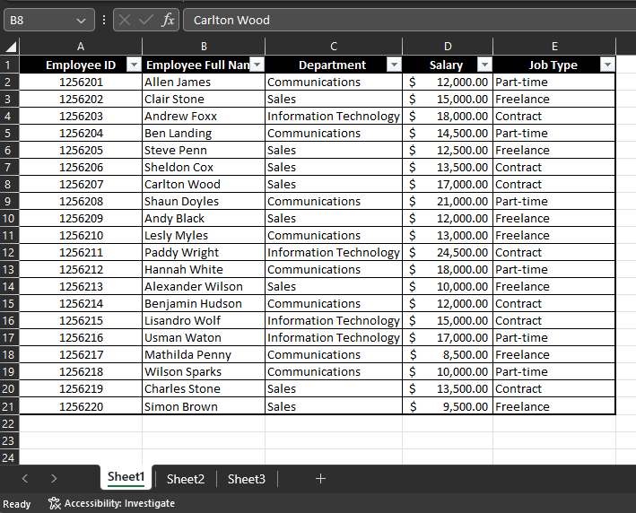
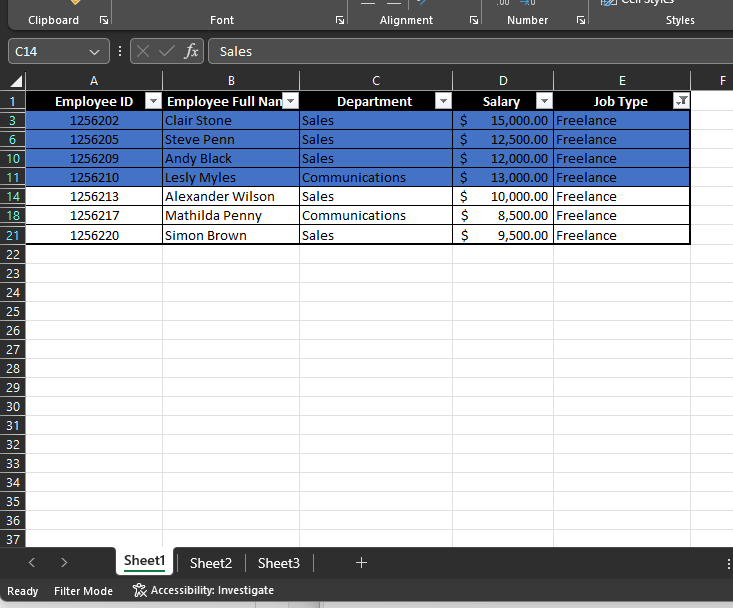
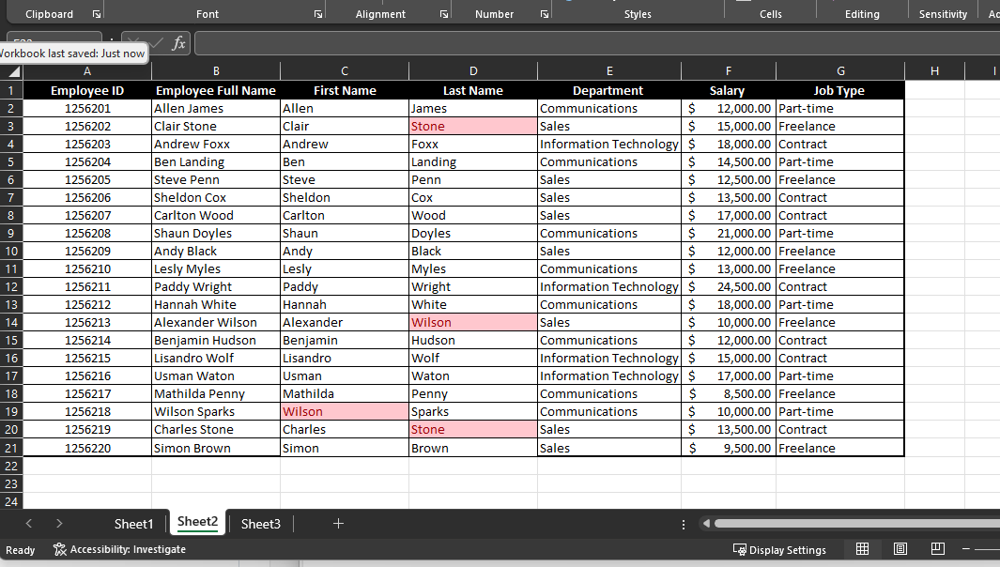
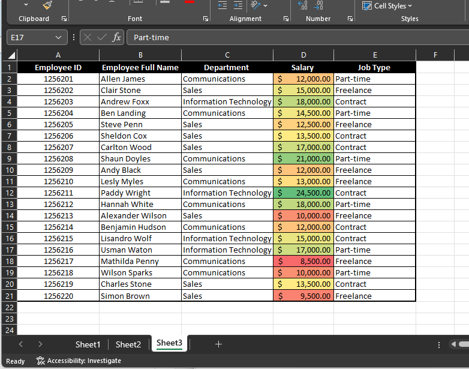

# TASK-1 ON LEARNING MICROSOFT EXCEL

## Task 1 - Create a table with 20 rows of information having the fields below: 
Employee ID

Employee Full Name

Department (Communications, Sales, I.T)

Salary (between $5000 to $25000)

Job type (Part-time, Freelance, Contract)

Copy and paste table into worksheet 2 and worksheet 3

## Task 2 - Show only employees who are ‘Freelancers’ and highlight the ones whose salaries are above $10000

## Task 3 - Split the employees’ full names into first name and last name. Check for duplicates and highlight if any (do not delete)

## Task 4 - Highlight employees whose names begin with the letter ‘E’ (in yellow). Format the Salary column such that the highest SALARY has a green background and the lowest SALARY has a red background.

Task include to document this Task on Github

End of Task 1.
